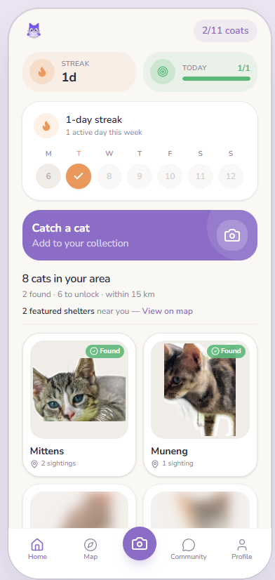
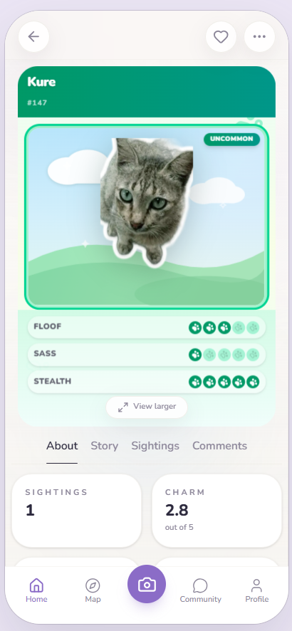
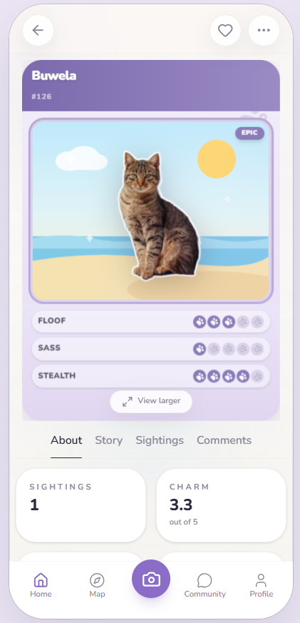
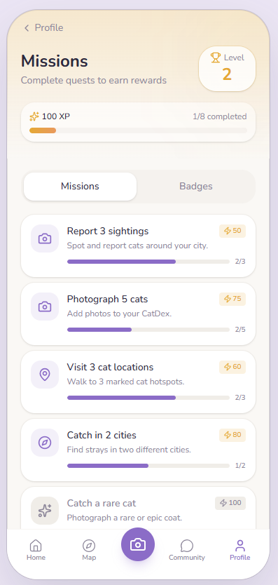
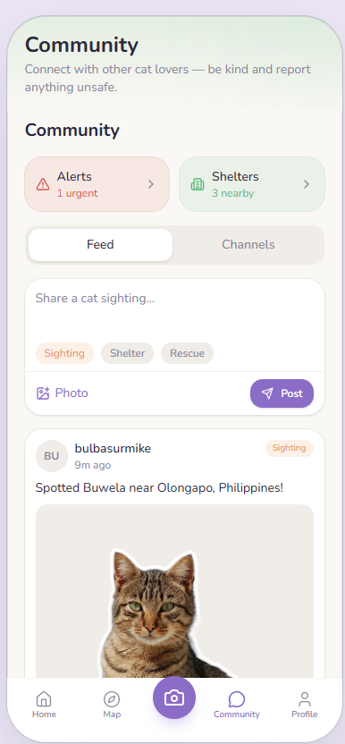

# Meowderer

**Catch real stray cats. Collect stickers. Map the world.**

A mobile-first PWA that turns every stray-cat photo into a collectible sticker — entirely on-device with AI-powered background removal and coat classification. No servers doing the heavy lifting, no API bills, just your camera and the cats around you.

## Screenshots

<p align="center">
  
  
  
</p>

<p align="center">
  
  
</p>

---

## The Pitch

You're walking down the street and spot a stray cat. You open Meowderer, snap a photo, and in seconds the app:

1. Removes the background **on-device** using WASM/WebGPU
2. Wraps it in a clean sticker outline
3. Auto-classifies the coat type and assigns a rarity (Common → Epic)
4. Pins the catch on a world map with GPS
5. Files it in your personal Meowderer collection

No fighting. No microtransactions. Just finding, photographing, and collecting.

---

## Tech Stack

| Layer | Choice |
|-------|--------|
| Framework | Next.js 16 (App Router) + React 19 + TypeScript |
| Styling | Tailwind CSS v4 + shadcn/ui + Framer Motion |
| Backend | Supabase (Auth + Postgres + RLS) |
| Media | Cloudinary (photo + sticker hosting) |
| PWA | Serwist (installable, offline-capable, model caching) |
| Background removal | `@imgly/background-removal` (on-device WASM/WebGPU) |
| Classification | Transformers.js + TensorFlow.js MobileNet |
| Map | MapLibre GL JS + OpenFreeMap tiles |
| State | Zustand + Server Components |

**Total infrastructure cost: $0.** Everything runs on free tiers.

---

## Key Features

- **On-device AI pipeline** — background removal, coat classification, and a "is this a cat?" guard run entirely in the browser
- **Sticker collection** — every catch becomes a transparent sticker with a hand-drawn outline effect, plus playful traits (floof, sass, stealth) and a charm rating
- **World map** — MapLibre-powered map with pins for every cat you've found, plus a community stray layer
- **Stray identity & shared albums** — AI-assisted linking ties multiple sightings to the same cat; a "Same cat?" match dialog lets you compare a cat's nearby album before confirming
- **Missions & XP** — quests, badges, streaks, and leveling up to keep you exploring
- **Community** — sighting posts, chat channels, and rescue alerts connecting local cat lovers
- **Fully offline** — the service worker caches the app shell and ML models for field use
- **Desktop phone-frame** — mobile-first 420px canvas, wrapped in a phone bezel on desktop

---

## Getting Started

```bash
npm install
npm run dev
```

Open [http://localhost:3000](http://localhost:3000).

> Both `npm run dev` and `npm run build` use the `--webpack` flag (required by the Serwist PWA plugin). The service worker is disabled in development to avoid caching headaches.

### Environment Variables

Copy `.env.example` to `.env.local` and fill in your values:

```bash
# Supabase — Auth + Postgres (client-safe; RLS protects your data)
NEXT_PUBLIC_SUPABASE_URL=https://<ref>.supabase.co
NEXT_PUBLIC_SUPABASE_ANON_KEY=<anon-key>

# Server-only (optional) — enables self-serve account deletion in Settings
SUPABASE_SERVICE_ROLE_KEY=<service-role-key>

# Public site URL — used for password-reset emails (defaults to localhost in dev)
NEXT_PUBLIC_SITE_URL=http://localhost:3000

# Cloudinary — photo + sticker uploads (cloud name is public; key/secret are server-only)
NEXT_PUBLIC_CLOUDINARY_CLOUD_NAME=<cloud-name>
CLOUDINARY_API_KEY=<api-key>
CLOUDINARY_API_SECRET=<api-secret>

# Hugging Face (optional) — read token for CLIP embeddings via the /api/ml/hf proxy.
# Cat detection uses TensorFlow.js and does not require this.
# HF_TOKEN=hf_...
```

### Database Setup

Run every migration in [`supabase/migrations/`](supabase/migrations) **in order** (`0001` → `0016`) using the Supabase SQL Editor. They create the schema, RLS policies, storage buckets, triggers, and seed data.

---

## Deploy

Push to GitHub and import the repo in [Vercel](https://vercel.com/new):

1. Framework preset: Next.js (the build uses webpack for the Serwist PWA).
2. Add every variable from `.env.example` under **Project Settings → Environment Variables**.
3. In **Supabase → Authentication → URL Configuration**, set the Site URL and add `https://<your-domain>/auth/callback` to the redirect URLs.
4. Node.js 20+ is required (pinned in `package.json` engines).

---

## Project Structure

```
src/
  app/            # Next.js App Router routes
    (app)/        # Authenticated routes (nav + phone frame)
    (auth)/       # Sign in / sign up / callback
    (catch)/      # Full-screen camera capture flow
    api/          # Server endpoints (uploads, ML proxy, stray-cats)
  components/     # UI + feature components
  lib/
    supabase/     # Server/browser Supabase clients
    capture/      # On-device sticker + matching pipeline (the core ML flow)
  stores/         # Zustand client state
supabase/
  migrations/     # Schema, RLS, storage policies, triggers, seed data
  scripts/        # Maintenance / backfill helpers
public/
  screens/        # App screenshots
  assets/         # Branding (logo, icons)
```

For a deeper dive, see [`ARCHITECTURE.md`](ARCHITECTURE.md), [`FEATURES.md`](FEATURES.md), and [`PRD.md`](PRD.md).

---

## License

Released under the [MIT License](LICENSE).
