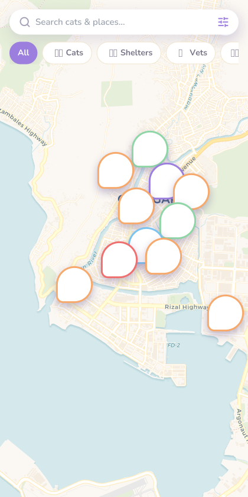
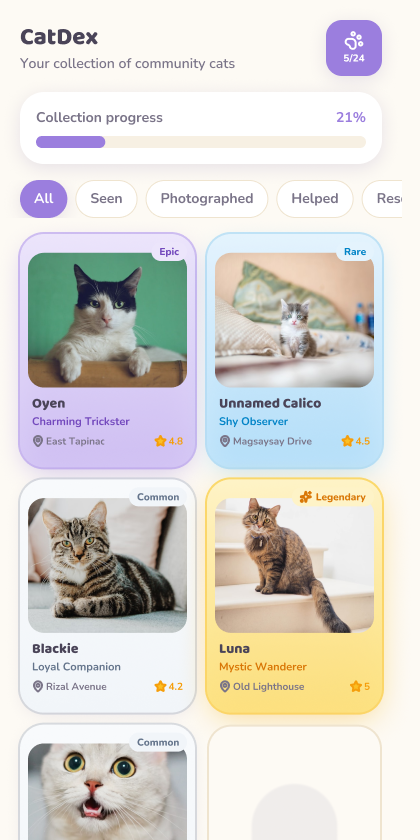
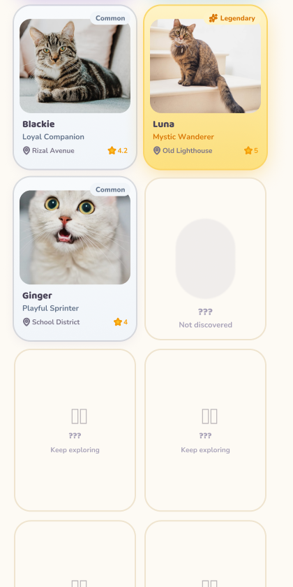
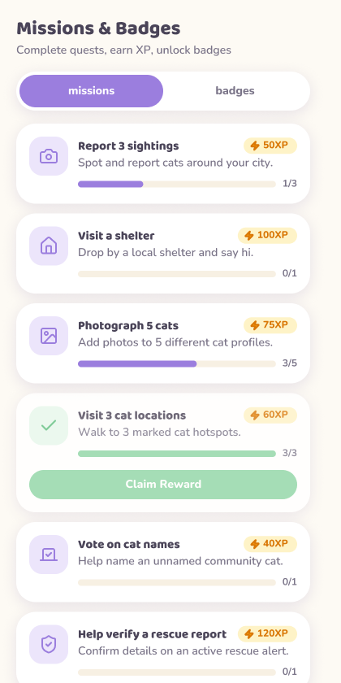
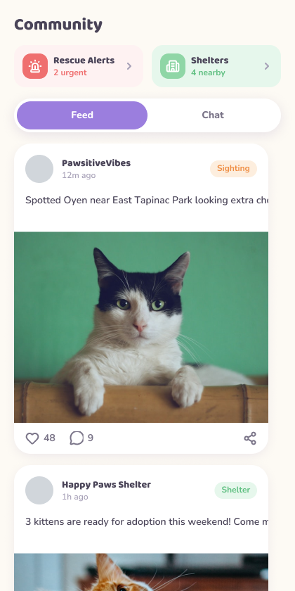
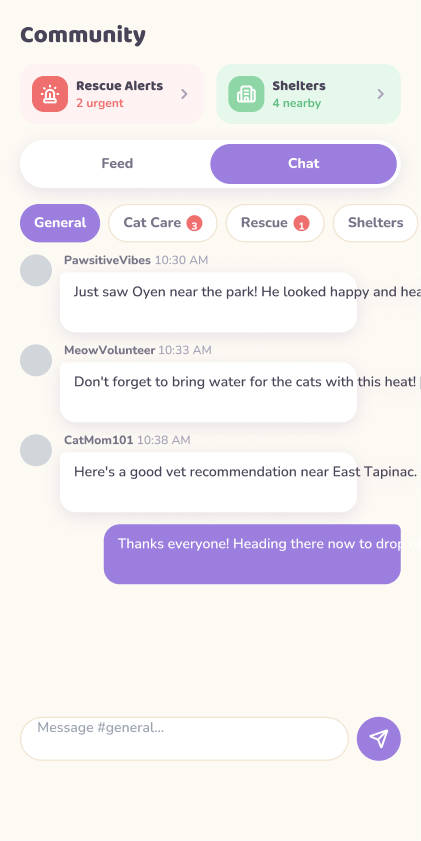
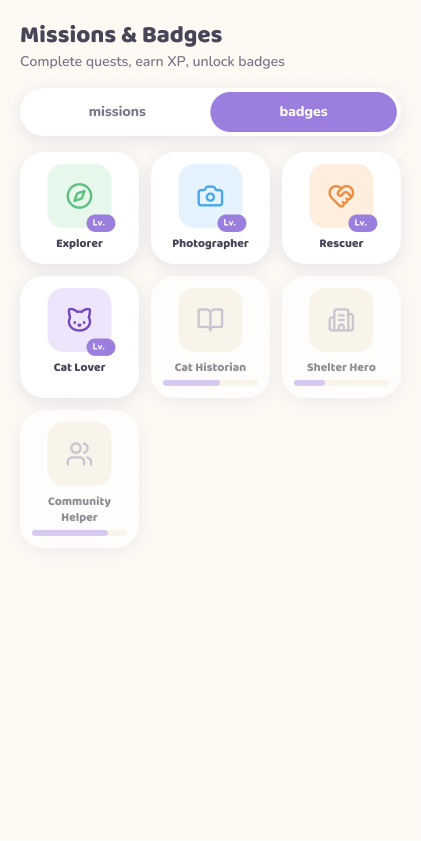

# CatDex

**Catch real stray cats. Collect stickers. Map the world.**

A mobile-first PWA that turns every stray cat photo into a collectible sticker — entirely on-device with AI-powered background removal and coat classification. No servers doing the heavy lifting, no API bills, just your camera and the cats around you.

> iNaturalist meets Pokemon GO meets a sticker book — but for stray cats.

---

## Screenshots

<p align="center">
  
  
  
  
</p>

<p align="center">
  
  
  
</p>

---

## The Pitch

You're walking down the street and spot a stray cat. You open CatDex, snap a photo, and in seconds the app:

1. Removes the background **on-device** using WASM/WebGPU
2. Wraps it in a clean sticker outline
3. Auto-classifies the coat type and assigns a rarity
4. Pins the catch on a world map with GPS
5. Files it in your personal CatDex collection

No fighting. No microtransactions. Just finding, photographing, and collecting.

---

## Tech Stack

| Layer | Choice |
|-------|--------|
| Framework | Next.js 16 (App Router) + React 19 + TypeScript |
| Styling | Tailwind CSS v4 + shadcn/ui + Framer Motion |
| Backend | Supabase (Auth + Postgres + RLS) |
| Media | Cloudinary (photo + sticker hosting) |
| PWA | Serwist (installable, offline-capable, model caching) |
| Background Removal | `@imgly/background-removal` (on-device WASM) |
| Classification | Transformers.js + TensorFlow.js MobileNet |
| Map | MapLibre GL JS + OpenFreeMap tiles |
| State | Zustand + Server Components |

**Total infrastructure cost: $0.** Everything runs on free tiers.

---

## Key Features

- **On-device AI pipeline** — background removal, coat classification, and cat detection run entirely in the browser
- **Sticker collection** — every catch becomes a transparent PNG sticker with a hand-drawn outline effect
- **World map** — MapLibre-powered map with GeoJSON pins for every cat you've found
- **Missions & XP** — quests, badges, streaks, and leveling up to keep you exploring
- **Community** — posts, chat channels, and rescue alerts connecting local cat lovers
- **Stray cat identity** — AI-assisted linking ties multiple sightings to the same cat
- **Fully offline** — service worker caches the app shell and ML models for field use
- **Desktop phone-frame** — mobile-first 420px canvas, wrapped in a phone bezel on desktop

---

## Getting Started

```bash
npm install
npm run dev
```

Open [http://localhost:3000](http://localhost:3000). The app runs from the repo root.

> `npm run build` uses `--webpack` (Serwist requirement). Dev uses Turbopack with SW disabled.

### Environment Variables

Copy `.env.example` to `.env.local` and configure:

```
# Supabase (required for auth + cloud save)
NEXT_PUBLIC_SUPABASE_URL=https://<ref>.supabase.co
NEXT_PUBLIC_SUPABASE_ANON_KEY=<anon-key>

# Cloudinary (required for photo uploads)
NEXT_PUBLIC_CLOUDINARY_CLOUD_NAME=<cloud-name>
CLOUDINARY_API_KEY=<api-key>
CLOUDINARY_API_SECRET=<api-secret>
```

### Database Setup

Run the migrations in Supabase's SQL Editor:
1. [`supabase/migrations/0001_init.sql`](supabase/migrations/0001_init.sql)
2. [`supabase/migrations/0002_achievements_seed.sql`](supabase/migrations/0002_achievements_seed.sql)

---

## Deploy

Push to GitHub and import in [Vercel](https://vercel.com/new). Set Node.js 20+, add env vars, and configure Supabase redirect URLs to your domain. Done.

---

## Project Structure

```
src/
  app/            # Next.js App Router routes
  components/     # UI + feature components
  lib/
    supabase/     # Server/browser Supabase clients
    capture/      # On-device sticker pipeline (the core ML flow)
  stores/         # Zustand client state
supabase/
  migrations/     # Schema, RLS, storage policies
public/
  screens/        # App screenshots
  assets/         # Branding (logo, icons)
```

---

## License

Private. Built as a solo hackathon project.
